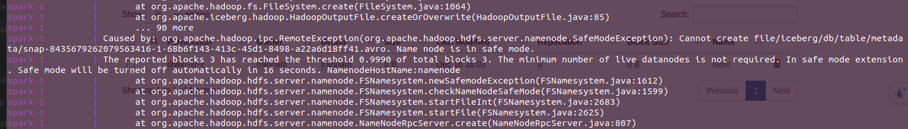
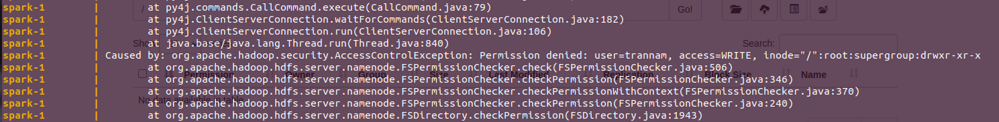
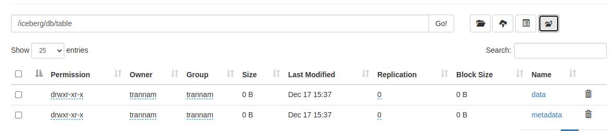
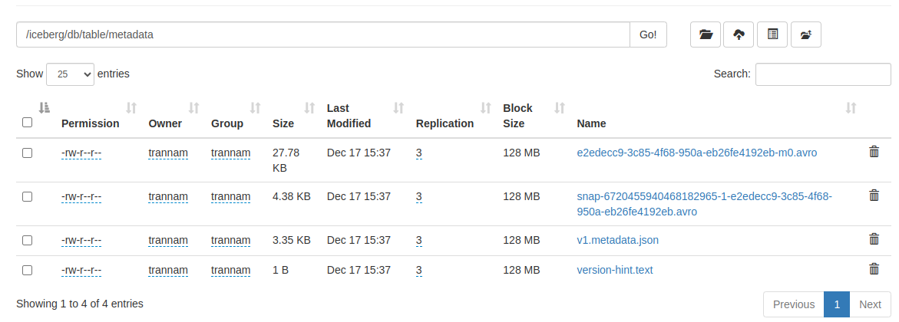
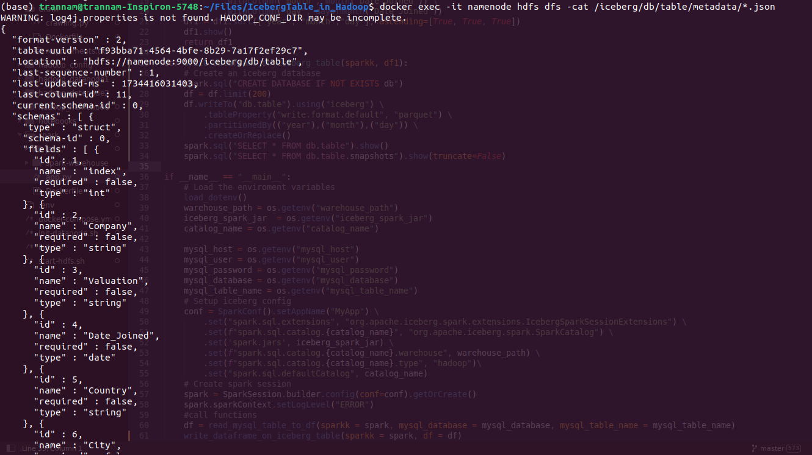
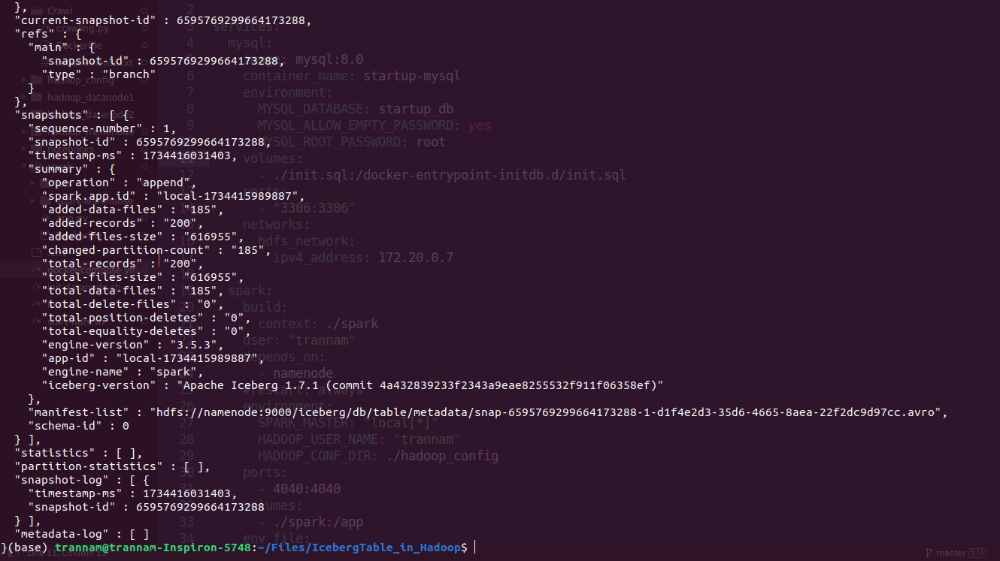
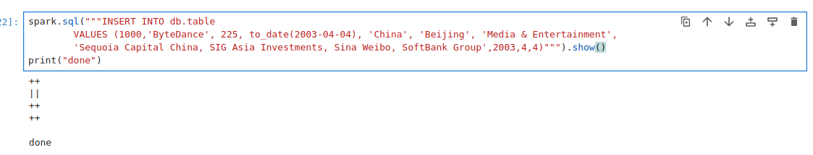
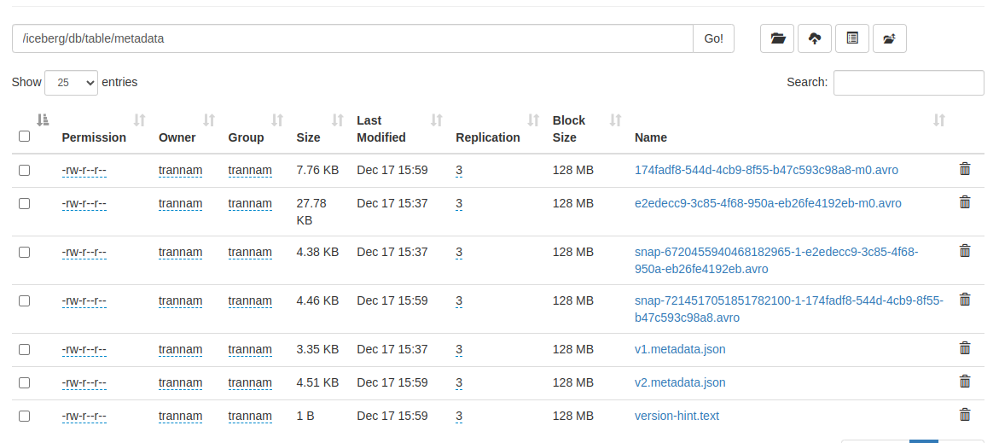

# Iceberg Table in Hadoop

This project demonstrates the use of **Apache Iceberg** tables within **HDFS**. It is a containerized environment set up using **Docker Compose**, which includes services such as MySQL, Spark, Hadoop (Namenode and Datanodes), and Jupyter Notebook. It provides an end-to-end environment for experimenting with Iceberg tables on Hadoop Distributed File System (HDFS).

---
## **Table of Content**
- [Project Structure](#-project-structure)
- [Services](#-services)
- [Prerequisites](#-prerequisites)
- [Setup and Run](#-setup-and-run)
- [Usage](#-usage)
- [Common Issues](#-common-issues)
- [Visuals](#-visuals)
- [Stop and Clean Up](#-stop-and-clean-up)
- [Contributing](#contributing)

---
## 📂 **Project Structure**

```plaintext
IcebergTable_in_Hadoop
├── docker-compose.yaml            # Docker Compose configuration file
├── hadoop_config/                 # Hadoop configuration files
│   ├── core-site.xml
│   └── hdfs-site.xml
├── hadoop_datanode1/              # Data storage for Datanode 1
├── hadoop_datanode2/              # Data storage for Datanode 2
├── hadoop_namenode/               # Data storage for Namenode
├── init-datanode.sh               # Initialization script for Datanodes
├── init.sql                       # MySQL initialization script
├── notebooks/                     # Jupyter Notebooks for testing
│   ├── Dockerfile
│   ├── readHDFS.ipynb
│   ├── test.ipynb
│   └── writeHDFS.ipynb
├── spark/                         # Spark service configurations
│   ├── app.py                     # Sample Spark application
│   ├── Dockerfile                 # Spark Dockerfile
│   ├── jars/                      # JAR files for Spark
└── start-hdfs.sh                  # Namenode start script
```

---

## 🚀 **Services**

This project uses the following services:

1. **MySQL**  
   - Database service for managing metadata.
   - Automatically loads initial SQL from `init.sql`.

2. **Spark**  
   - Processes data stored in HDFS using Spark applications.
   - Runs the application defined in `spark/app.py`.

3. **Jupyter Notebook**  
   - Interactive environment for testing data read/write operations.
   - Located in the `notebooks/` directory.

4. **Hadoop Namenode and Datanodes**  
   - Simulates an HDFS cluster with one Namenode and two Datanodes.

---

## 🔧 **Prerequisites**

Make sure you have the following installed:

- [Docker](https://docs.docker.com/get-docker/)
- [Docker Compose](https://docs.docker.com/compose/)

---

## ⚙️ **Setup and Run**

### 1. Clone the Repository

```bash
  git clone https://github.com/trann-namm/IcebergTable_in_Hadoop.git
  cd IcebergTable_in_Hadoop
```

### 2. Start the Environment

Run the following command to start all services:

```bash
  docker compose up --build
```


### 3. Verify Services

- Access **Namenode UI**: `http://localhost:9870`  
- Access **Jupyter Notebook**: `http://localhost:8888`  
- Access **Spark UI**: `http://localhost:4040`  
- MySQL is available on port `3306`.

---

## 📊 **Usage**

1. **Jupyter Notebook**  
   Open Jupyter at [http://localhost:8888](http://localhost:8888) to interact with pre-built notebooks:
   - `readHDFS.ipynb`: Read data from HDFS.
   - `writeHDFS.ipynb`: Write data to HDFS.
   - `test.ipynb`: Test different operations.

2. **HDFS**  
   Access [http://localhost:9870](http://localhost:9870) to track file system

3. **MySQL**  
   Use MySQL to manage metadata and connect to other services.

---

## 🐞 **Common Issues**

### 1. Namenode in Safe Mode
If namenode is in **Safe mode**

You can run the command:
```bash
  docker exec -it namenode hdfs dfsadmin -safemode leave
```

### 2. Permission Errors
If you faced the error **Permission denied**

You can run the command:
```bash
  docker exec -it namenode hdfs dfs -chown -R trannam:trannam /
```
### 3. Spark can't connect to MySQL
Sometimes, Spark cannot retrieve data from MySQL and shuts down immediately due to a connection error. This happens because MySQL has not fully started yet.
You can wait a second and run the following command to restart spark container:

```bash
  docker start icebergtable_in_hadoop-spark-1
```
## 📸 **Visuals**

Here are some visual examples included in the project:

- **Iceberg Table Format** 

- **Metadata Folder** 

- **A metadata File**


- **You can run the cripts to insert into Iceberg Table**

- **Then the metadata folder will change**


---

## 🛠️ **Stop and Clean Up**

To stop all services and clean up containers:

```bash
  docker compose down
```

---

## **Contributing**

We welcome contributions! To contribute:
1. Fork the repository.
2. Create a new branch:
   ```bash
   git checkout -b feature/your-feature-name
   ```
3. Commit your changes:
   ```bash
   git commit -m "Add feature: your-feature-name"
   ```
4. Push the changes:
   ```bash
   git push origin feature/your-feature-name
   ```
5. Open a pull request.

---

## 📄 **License**

This project is licensed under the MIT License. See [LICENSE](LICENSE) for details.

---

## **Contact**
If you have any questions, feel free to reach out:
- Email: namsherlock44@outlook.com
- GitHub: [@trann-namm](https://github.com/trann-namm)

---
